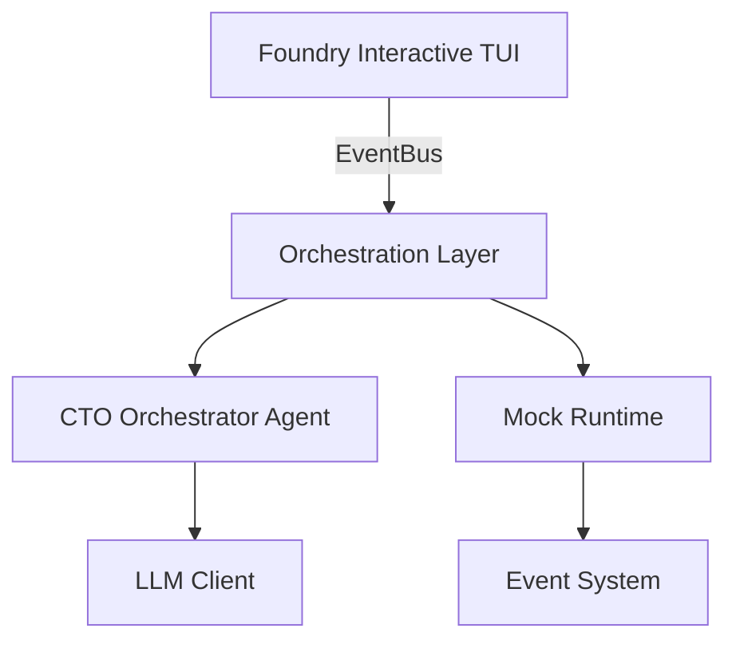
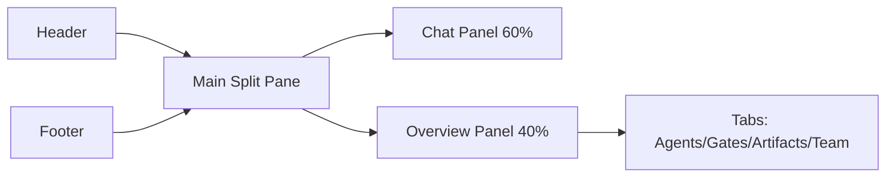
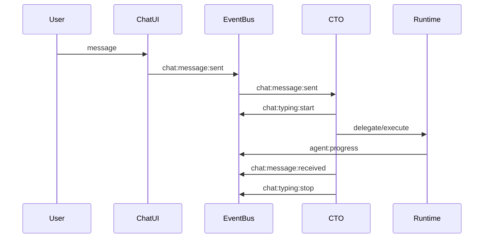
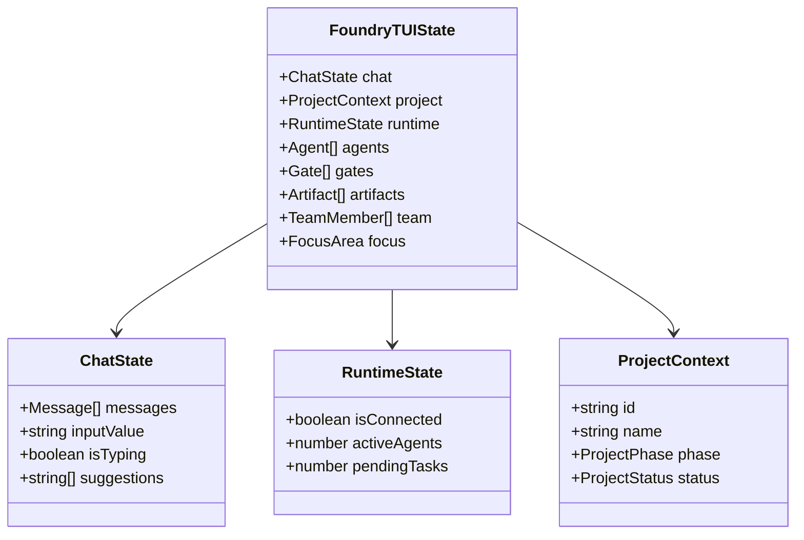

# Foundry Interactive TUI v2 - Architecture

This document describes the architecture of the Foundry Interactive TUI system.

## System Overview



## UI Layout



## Event Flow



## State Model



## Component Architecture

### Layout Components

- **MainLayout**: Root layout managing the split-pane structure
- **Header**: Project information, connection status, active agents
- **Footer**: Keyboard shortcuts, current focus indicator
- **HelpOverlay**: Keyboard shortcuts and command reference

### Chat Components

- **ChatPanel**: Main chat interface container
- **MessageList**: Scrollable message history
- **SuggestionBar**: Command suggestions based on input
- **MessageItem**: Individual message display

### Overview Components

- **OverviewPanel**: Tabbed container for different views
- **ProjectPanel**: Project details and runtime status
- **AgentPanel**: Active agents with progress bars
- **GatePanel**: Quality gates with status indicators
- **ArtifactPanel**: Artifact list with metadata
- **TeamPanel**: Team members and availability

## Event System

### Event Types

#### Chat Events
- `chat:message:sent` - User sent a message
- `chat:message:received` - Agent/system sent a message
- `chat:typing:start` - Agent started typing
- `chat:typing:stop` - Agent stopped typing
- `chat:suggestion:add` - Add command suggestion

#### Agent Events
- `agent:spawned` - New agent created
- `agent:progress` - Agent progress update
- `agent:completed` - Agent finished task
- `agent:failed` - Agent encountered error

#### Gate Events
- `gate:status:changed` - Gate status updated

#### CTO Events
- `cto:delegate` - CTO delegated task
- `cto:command` - CTO executed command
- `cto:review:requested` - CTO requested review
- `cto:escalate` - CTO escalated issue

## State Management

### Store Architecture

```typescript
interface StoreContextType {
  state: FoundryTUIState;
  dispatch: React.Dispatch<Action>;
}
```

### Actions

All state changes are handled through actions:

```typescript
type Action =
  | { type: 'CHAT_SEND_MESSAGE'; payload: { content: string; role?: 'user' | 'system' } }
  | { type: 'CHAT_RECEIVE_MESSAGE'; payload: Message }
  | { type: 'AGENT_ADD'; payload: Agent }
  | { type: 'GATE_SET_STATUS'; payload: { id: string; status: GateStatus } }
  | ...
```

## CTO Agent

The CTO Agent is the core orchestration component:

### Intent Analysis

1. Parse user message
2. Classify intent (command, question, delegate, review, status, escalate, greeting)
3. Determine confidence level
4. Identify required context

### Context Gathering

Based on intent, gather relevant context:
- Project state
- Active agents
- Quality gates
- Artifacts
- Team members

### Execution

Based on intent and context:
- **command**: Execute system command
- **question**: Provide information
- **delegate**: Spawn new agent
- **review**: Initiate review process
- **status**: Report project status
- **escalate**: Escalate to human

## Mock Runtime

The Mock Runtime simulates the full system:

### Demo Data

- Pre-configured project
- Sample agents with tasks
- Quality gates with checks
- Example artifacts
- Team members

### Auto-Progress

- Simulates agent progress updates
- Randomly completes tasks
- Generates events

### Command Handling

Intercepts slash commands:
- `/status` - Show status
- `/agents` - Switch to agents view
- `/spawn` - Create new agent
- `/phase` - Change project phase

## Development

### File Organization

```
src/
├── components/       # UI components organized by feature
│   ├── chat/
│   ├── layout/
│   └── overview/
├── agents/          # Agent implementations
├── hooks/           # React hooks
├── mock/            # Mock implementations
├── services/        # Core services
├── store/           # State management
└── types/           # Type definitions
```

### Testing Strategy

- **Unit Tests**: Services (EventBus), Reducer logic
- **Integration Tests**: Agent behavior, Event flow
- **Component Tests**: Component rendering (future)

### Type Safety

- Strict TypeScript mode
- Zod schemas for runtime validation
- Explicit return types on public methods

## Integration Points

### Future Integrations

The architecture supports:
- Real LLM providers (OpenAI, Anthropic, etc.)
- External orchestration systems
- Real-time collaboration backends
- Persistence layers

### Interface Definitions

All external dependencies are abstracted through interfaces:
- `LLMClient`: For AI completions
- `EventBus`: For event communication
- `Runtime`: For execution environment

This ensures the system remains testable and adaptable.
